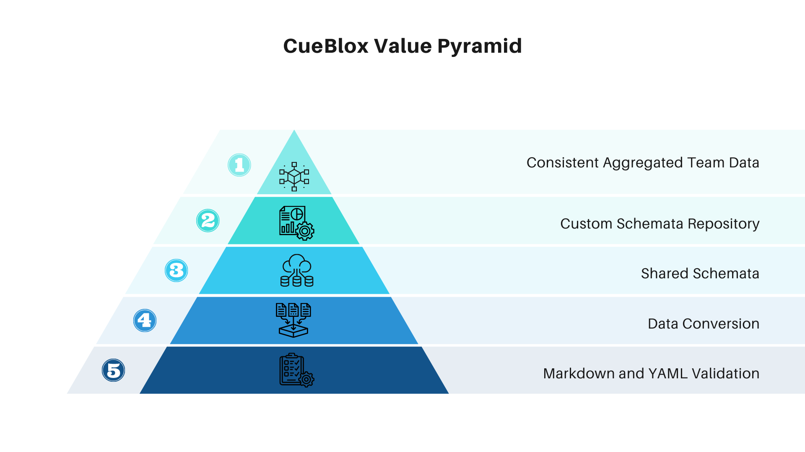

# What is CueBlox?

CueBlox is a set of tools that allow you to create and consume datasets from YAML or Markdown files.

At the core is a tool that aggregates similar files into collections of data. If you've ever built a website with a static site generator like Hugo, this will be familiar.

Where CueBlox really shines though is in the additional functionality it enables. CueBlox has several features that enable some interesting and novel integrations for your data:




## Markdown and YAML Validation

Ensure your data is always valid by providing defaults and validation rules using the [Cue](https://cuelang.org) language to define schemata for your data.

The schema that validates this page looks like the code block below. We've commented it pretty heavily to introduce you to Cue.

```json
// Anything prefixed with '#' in Cue is called a "Definition". Think of it like a struct.
#Page: {
    // Anything prefixed with '_' is "private". This will not be exported
    // when converting this Cue to another format.
  	_dataset: {
        // "pages" is a concrete value. It cannot be modified later
  		plural: "pages"

        // Cue supports lists, much like YAML. This is also concrete
  		supportedExtensions: ["yaml", "yml", "md", "mdx"]
  	}

    // These values are open (not concrete), as they're represented as types
  	title:        string
  	excerpt:      string

    // Using `|` is a disjunction and means multiple values are being supported.
    // Here we're saying that draft can be a bool "OR" *false,
    // where "*" indicates a default value
  	draft:        bool | *false

  	publish_date: string

    // "?" means optional. This value doesn't need to exist in the data
    // the omission of "?" means required
  	image?:       string
  	body?:        string

    // Tags is a list of strings
    // Lists can be a little weird at first, with Cue.
    // "[string]" would mean a list with a single string value
    // "[string, int]" would mean a list with the first value string, second value int
    // "..." here means any number of string values
  	tags?: [...string]
  	section_id?: string
  	weight?:     int
  }
```

## Data Conversion

Data that is locked in your git repository is only useful in that repository. CueBlox allows you to validate, aggregate, and export your data in the integration-friendly JSON format for consumption elsewhere. The data that drives this website is processed through CueBlox and automatically published as a GitHub release. You can see it [here](https://github.com/cueblox/blox/releases/tag/blox)


## Shared Schemata

The schemata you create are available to you locally in your content directory. But you can also create a set of schemata that is published for others to consume. The schema we use to build all of the CueBlox website are published on [this website](https://schemas.cueblox.com/) All the information about the schemata available, including version information is available in the `manifest.json` file linked in the HTML.

The `blox` cli tool allows you to add these remote schemata to your project:

```
❯ blox remote list schemas.cueblox.com
Namespace           | Schema   | Version
schemas.cueblox.com | article  | v1
schemas.cueblox.com | category | v1
schemas.cueblox.com | page     | v1
schemas.cueblox.com | profile  | v1
schemas.cueblox.com | section  | v1
schemas.cueblox.com | website  | v1

❯ blox remote get schemas.cueblox.com page v1
```

Using published schemata this way allows you to create and consume standardized data across several projects, teams, and people. In fact, it is the core driver for our development of CueBlox -- enabling teams to publish information individually, but have it aggregated and consumed at a higher level without data validation worries. When everyone uses the same schema, all the data is always consistent.

## Custom Schemata Repository

When you grow beyond the schemata we provide by default you can use the `blox repo` command to create your own schema repository. You'll have full control over the definitions and you can point your team at your custom repository to keep everyone on the same page.

## Consistent Aggregated Team Data

When everyone uses the same schemata you can easily aggregate data from multiple sources with the confidence that there won't be any anomalies or inconsistencies in their data. Manage a team event calendar. Create a publishing schedule for your social media. Aggregate documentation from different projects into a single website. You're only limited by your imagination.


## Leverage all of this functionality using GitOps principles

CueBlox was built for lazy people. If it can be generated, we generate it. If it can be automated, we automate it. The end result is that the only thing you need to do to publish your content is check it into your git repository. GitHub actions take care of the rest!


## Use third party tools to make your data easily accessible

CueBlox `build` command provides a JSON file that can be published as a release artifact, that works extremely well with GraphQL and REST based API providers. In fact, this [website is built](https://github.com/cueblox/blox/dogfood/) on this feature.
